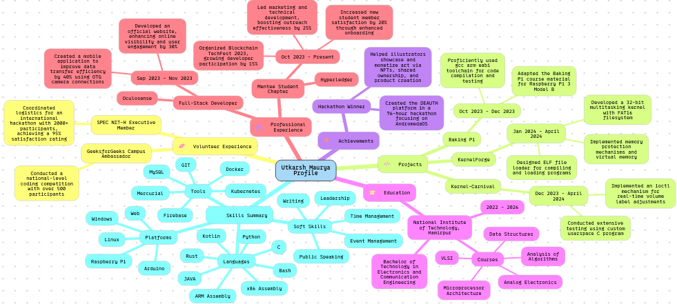

## Hey, I'm Utkarsh 👋 

I'm a 20-year-old developer, this is where code goes to die (and occasionally, to live again).

- Check out my [portfolio website](https://utkarshs-terminal.netlify.app/) to learn more about me.
- Explore my [blog](https://medium.com/@sankalp.1519) where I share insights and learnings.
- Stay updated with my journey on [Instagram](https://www.instagram.com/gilfoyle_2.0/), [LinkedIn](https://www.linkedin.com/in/utkarsh-maurya-connect/) and [YouTube](https://www.youtube.com/@tss.TheSkillShow).
- Explore my [dotfiles](https://github.com/pro-utkarshM/dotfiles) for development optimization.
- Yes I do [Leetcode](https://leetcode.com/pro-utkarshM/), but I don't like it 🙂;

---

<h2 align=center> Been battling some nasty ext4 corruption issues lately. </h2>

 In the meantime, gotta grab some coffee and wrestle with this pesky DMA bug on the new ARM board.  
 ️ Working on: ext4 journaling improvements, ARM DMA bugfix 
☕️ Fueling the grind: Coffee (copious amounts)

## ⚡️ Tech Stack ⚡️

 
 
 
 
 
 
 
 

## 🌐 Socials:
 
 
 
 

# 📊 GitHub Stats:

 
 

## 🏆 GitHub Trophies

## 📊 My Profile

### ✍️ Random Dev Quote

---

